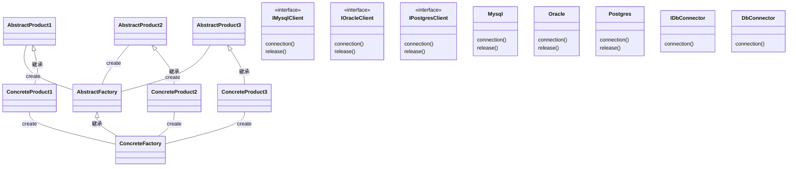

# AbstractFactory

```mermaid
classDiagram
	AbstractProduct1 --   AbstractFactory   : create
	AbstractProduct2 --   AbstractFactory   : create 
	AbstractProduct3 --   AbstractFactory   : create 
	AbstractFactory  <|-- ConcreteFactory   : 継承
	AbstractProduct1 <|-- ConcreteProduct1  : 継承
	AbstractProduct2 <|-- ConcreteProduct2  : 継承
	AbstractProduct3 <|-- ConcreteProduct3  : 継承
	ConcreteProduct1 --   ConcreteFactory   : create
	ConcreteProduct2 --   ConcreteFactory   : create
	ConcreteProduct3 --   ConcreteFactory   : create

	class IMysqlClient {
		<<interface>>
		connection()
		release()
	}
 
	class IOracleClient {
		<<interface>>
		connection()
		release()
	}
 
	class IPostgresClient {
		<<interface>>
		connection()
		release()
	}
 
	class Mysql{
		connection()
		release()
	}
	class Oracle{
		connection()
		release()
	}
	class Postgres{
		connection()
		release()
	}
 
	class IDbConnector{
		 connection()
	}
 
	class DbConnector{
		 connection()
	}
```
