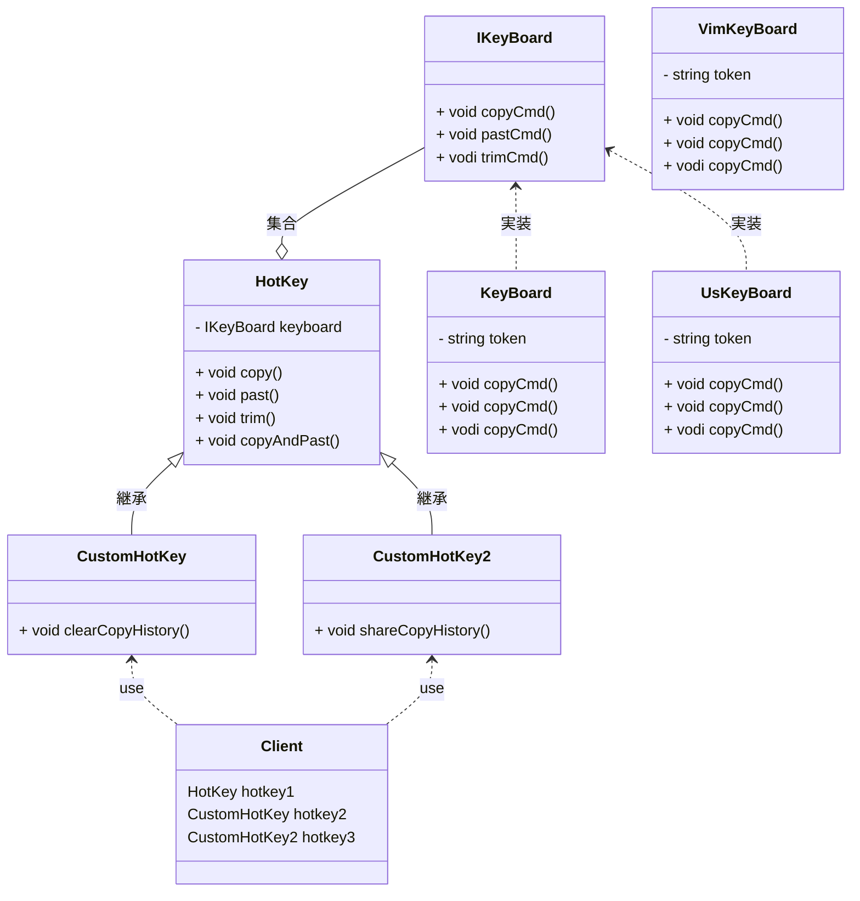

# 用途、ユースケースを自分の言葉で説明 (約1分)
Bridge パターンは機能と実装を分割し、追加の変更に強くする設計の工夫といえると思います。
同じインターフェースだが、カスタマイズしたい場合や環境ごとの対応を実装でカバーするときに有効だと感じています。
Template, AbstractFactory もみえてきますが、 今回重要なのは委譲関係を使っている点です。

# サンプルの概要説明 (約1分)
サンプルはHotkeyをカスタマイズできるアプリケーションの機能を想定しました。
Hotkey が 機能階層の最上位、IKeyBoardが 実装階層の最上位となっています。

# クラス図の説明 (約1分)
クラス図はこんな感じです。
呼び出し側から読みたい場合は Clientから見てください。
HotKey が keyboard をnew しているのがポイントです。

    classA --|> classB : Inheritance(継承)
    classM ..|> classN : Realization(実装)
    classC --*  classD : Composition(構成)
    classE --o  classF : Aggregation(集計)
    classG -->  classH : Association(関連)
    classI --   classJ : Link(Solid)(リンク)
    classO ..   classP : Link(Dashed)(リンク)
    classK ..>  classL : Dependency(依存関係)
    + Public
    - Private
    # Protected
    * Abstract e.g.: someAbstractMethod()*
    $ Static e.g.: someStaticMethod()$

# ソースコードの説明 (約1分)
機能をHotkey
実装をIkeyBoardとして分割して考えています。
今回のパターンを適用することで追加しやすくなる場所は２つあります。
- Hotkeyを継承して機能拡張を行う場合 CustomHotKey と同列のクラスが追加しやすいです。
- IkeyBoardを実装しているクラスも interface に沿って実装すればいろんなカスタマイズ機能から仕様できます。

以下に対応できるのでは？と思います。
ユーザが個別にHotkeyを追加する場合は Custormを増やす。
ユーザが使っているKeyboardが新たな規格の場合は KeyBoardを実装する。

# メリットを、サンプルコードを用いて自分の言葉で説明 (約1分)
- RefinedAbstraction に当たる部分を追加するのが容易になる。
- ConcreteImplementor に当たる部分も追加するのが容易になる。
- 追加が容易になる点にふれたが、実装の再利用できている点も注目するところ。
HotKeyにkeyboadがなければCustomごとに実装を追加する事となり重複コードも増えるためメンテが大変になる。
