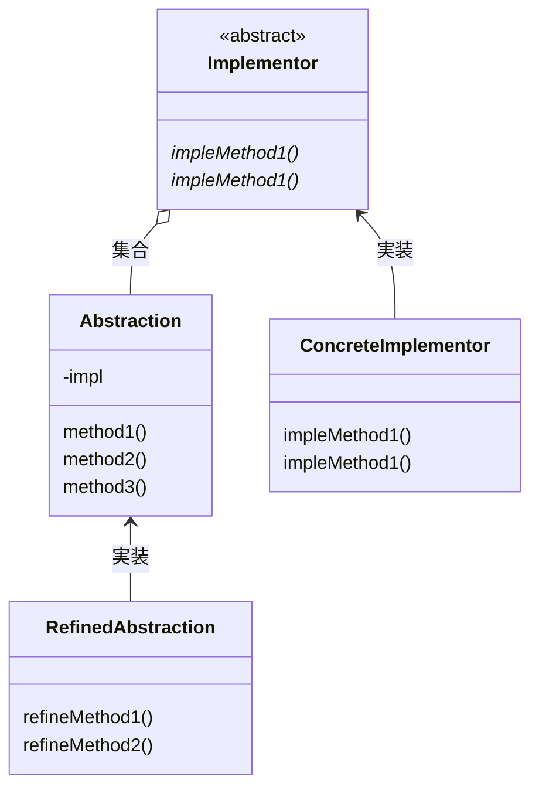

    classA --|> classB : Inheritance(継承)
    classM ..|> classN : Realization(実装)
    classC --*  classD : Composition(構成)
    classE --o  classF : Aggregation(集計)
    classG -->  classH : Association(関連)
    classI --   classJ : Link(Solid)(リンク)
    classO ..   classP : Link(Dashed)(リンク)
    classK ..>  classL : Dependency(依存関係)
    + Public
    - Private
    # Protected
    * Abstract e.g.: someAbstractMethod()*
    $ Static e.g.: someStaticMethod()$

