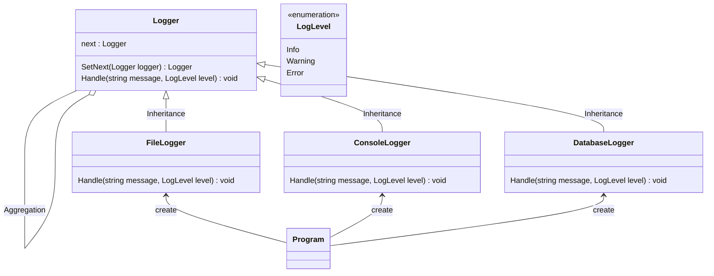

# 用途、ユースケースを自分の言葉で説明 (約1分)
ChainOfResponsibilityパターンは 自分の担当外の処理を別のオブジェクトにまかせて仕事を横流しするような設計パターンとなっています。
特定の処理だけ決まったクラスに処理させたい。といったニーズに答えることができる。

ユースケースとしては
- ウィンドウイベントのシステム（クリックイベントとか）
- ユーザ認証システム（名前を見た後に、パスワードを検証するとか）
- ログ出力の処理をレベルによって分けるとか

# サンプルの概要説明 (約1分)
今回実装したサンプルは ログ出力プログラムです。
enumで定義しているログレベルによってログの書き込み先を変更する事ができます。

- ConcreateHandler = FileLogger, DatabaseLogger, ConsoleLogger
- Handler = Logger
- Client = Program

# クラス図の説明 (約1分)
    classA --|> classB : Inheritance(継承)
    classM ..|> classN : Realization(実装)
    classC --*  classD : Composition(構成)
    classE --o  classF : Aggregation(集計)
    classG -->  classH : Association(関連)
    classI --   classJ : Link(Solid)(リンク)
    classO ..   classP : Link(Dashed)(リンク)
    classK ..>  classL : Dependency(依存関係)
    + Public
    - Private
    # Protected
    * Abstract e.g.: someAbstractMethod()*
    $ Static e.g.: someStaticMethod()$

# ソースコードの説明 (約1分)
- Logger はAbstractClassとなっており、このパターンのLoggerの基礎であるSetNextをもっています。
- File, Database, Consoleはそれぞれ個別のHandleを持っています。担当外であれば次へ渡します。
- サンプルコードでは末尾のオブジェクトまで行くと処理が終了します。
- リング状にするならベースケースが必要だと思います。

# メリットを、サンプルコードを用いて自分の言葉で説明 (約1分)
- ConcreteHandler役の部品としての独立性が高くなるのでメンテナンスはしやすいし、テストも書きやすくなりそう。
- すべてのConcreteHandler役を連鎖しとかないとなぜうまく処理されないのか？などデバッグする時が大変になる。
- そもそも全部連結させる処理が面倒ではある。それに、局所的に見れば必要ないオブジェクトまで作成して連結させているので無駄は多くなっている。
- そのあたりのデメリットを考慮してもClassを部品化して保守性を高めるのがいい点なのでは？
- 動的に差し替えができるので ウィンドウシステムのイベントなどは このイベントの前にこの処理を差し込むみたいな使い方が実現できる。