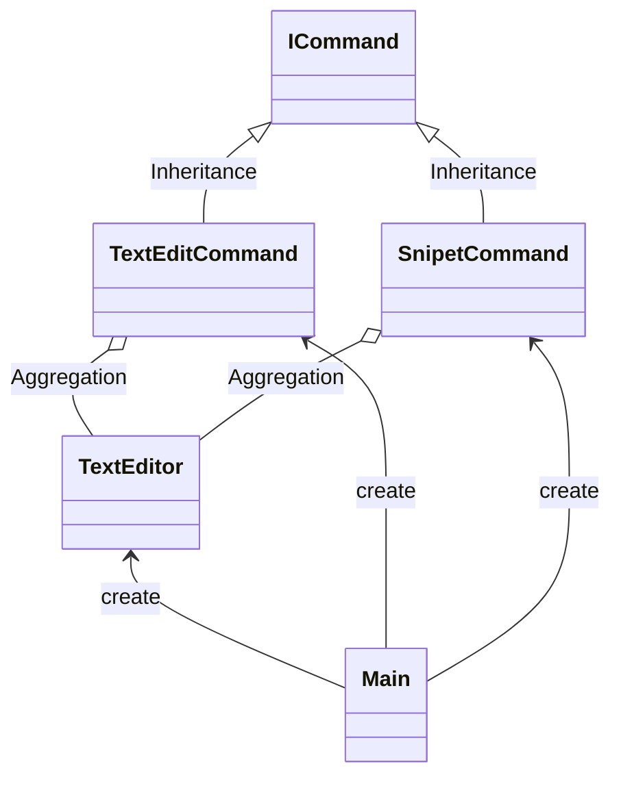

# 用途、ユースケースを自分の言葉で説明 (約1分)
コマンドパターンとは履歴を管理し、それを実行するという形で実行インスタンスを管理する設計

1. テキストエディタのundo/redo
2. GUIボタンをコマンドにしてマクロ登録
3. テストの自動化（実行順序を記録）
4. 音楽プレイヤーのボタン操作とか？

# サンプルの概要説明 (約1分)
名前： テキストエディタのundo/redo

# クラス図の説明 (約1分)
本に書かれているクラスがどれに該当するか説明する。

| original | text |
| ---------| -----| 
|ICommand| Command|
|TextEditor | Receiver|
|SnipetCommand |ConcreateCommand|
|TextEditCommand | ConcreateCommand|
|Main | Invoker, Client|

# ソースコードの説明 (約1分)
- Mainを見せてから流れと役割を説明する。

# メリットを、サンプルコードを用いて自分の言葉で説明 (約1分)
- 採用したときのメリット、デメリット
- 採用しないと起こるであろう問題

