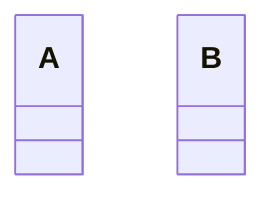

# 用途、ユースケースを自分の言葉で説明 (約1分)

# サンプルの概要説明 (約1分)
名前： 〜〜システム

# クラス図の説明 (約1分)
本に書かれているクラスがどれに該当するか説明する。
    classA --|> classB : Inheritance
    classC --* classD : Composition
    classE --o classF : Aggregation
    classG --> classH : Association
    classI -- classJ : Link(Solid)
    classK ..> classL : Dependency
    classM ..|> classN : Realization
    classO .. classP : Link(Dashed)

# ソースコードの説明 (約1分)
- Mainを見せてから流れと役割を説明する。

# メリットを、サンプルコードを用いて自分の言葉で説明 (約1分)
- 採用したときのメリット、デメリット
- 採用しないと起こるであろう問題

