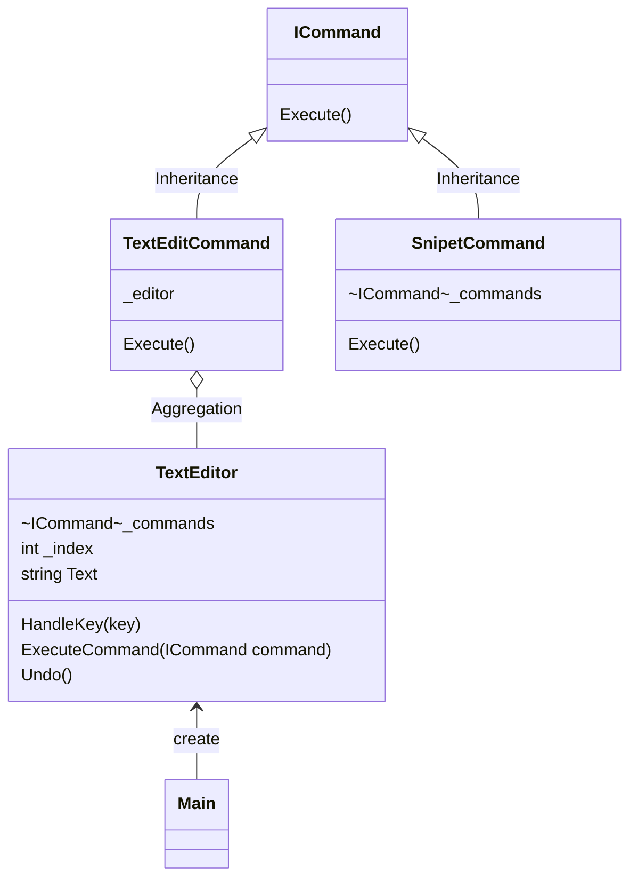

# 用途、ユースケースを自分の言葉で説明 (約1分)
コマンドパターンとは履歴を管理し、それを実行するという形で実行インスタンスを管理する設計

1. テキストエディタのundo/redo
2. GUIボタンをコマンドにしてマクロ登録
3. テストの自動化（実行順序を記録）
4. 音楽プレイヤーのボタン操作とか？

# サンプルの概要説明 (約1分)
名前： テキストエディタのundo/redo

# クラス図の説明 (約1分)
本に書かれているクラスがどれに該当するか説明する。

| original | text |
| ---------| -----| 
|ICommand| Command|
|TextEditor | Receiver|
|SnipetCommand |ConcreateCommand|
|TextEditCommand | ConcreateCommand|
|Main | Invoker, Client|

# ソースコードの説明 (約1分)
- Mainを見せてから流れと役割を説明する。
Mainができていなくてすみません。
Editorを最初に作り、Editorに向かってコマンドを実行していきます。
ExecuteCommandを実行するとcommandsのforeachで実行することである状態までのTextを復元する。

# メリットを、サンプルコードを用いて自分の言葉で説明 (約1分)
- 採用したときのメリット、デメリット
メリット
実行するオブジェクトと操作するオブジェクトを分離することで役割がわかりやすくなった。
新しい操作を追加する場合、新しいコマンドを作成するだけで良いので影響が少なさそう。
コマンドのListを持つことでundo/redoのコマンドが実現できる。

デメリット
コマンドの数が増えると、管理が大変そうなのでできるだけ少なくしておきたい。
コマンドを実行するためにインスタンスができるのが動作が重くなるのでは？と感じる。

- 採用しないと起こるであろう問題
textをundoしたい場合は文字を削除してbackupしてといった管理が必要になるため同じ変数をずっと操作することことになる。
ロックすべき場所が増えるのでは？
