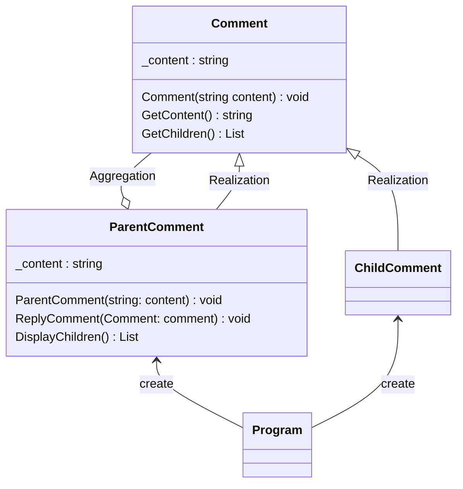

# 用途、ユースケースを自分の言葉で説明 (約1分)
Composite パターンは木構造をクラスで表現したような設計パターンとなっている。
Leafを格納できるCompositeを作成し、両方を扱うためのClassも追加してセットの設計といえる。
『容器と中身の同一視』

# サンプルの概要説明 (約1分)
自治体をComopnentと見立てて Composite を市 Leaf を町として書いてみた。

# クラス図の説明 (約1分)
    classA --|> classB : Inheritance(継承)
    classM ..|> classN : Realization(実装)
    classC --*  classD : Composition(構成)
    classE --o  classF : Aggregation(集計)
    classG -->  classH : Association(関連)
    classI --   classJ : Link(Solid)(リンク)
    classO ..   classP : Link(Dashed)(リンク)
    classK ..>  classL : Dependency(依存関係)
    + Public
    - Private
    # Protected
    * Abstract e.g.: someAbstractMethod()*
    $ Static e.g.: someStaticMethod()$

    class ChildComment {
        _content : string
        GetContent() string
    }

# ソースコードの説明 (約1分)
市、町を自治体としてみたってやろうとしましたが、うまくできなかったのでコメント機能について考えてみようと思います。

機能
- コメントの返信一覧を閲覧する。
Component → Comment
Composite → Parent
Leaf      → child

# メリットを、サンプルコードを用いて自分の言葉で説明 (約1分)
- メリットとして呼び出し側からの使い方が同一になっていることがいい点になっている。
Compositeだけができる部分は未実装でおいておくことでこのLeafはaddできない。が明確にわかる。
- Comopnent役を設置することで再帰的に呼び出しが可能になっているので一覧表示機能などが必要なら効果を発揮できそう。
- Webアプリならコメント機能などはこの構造でもできるかも？

