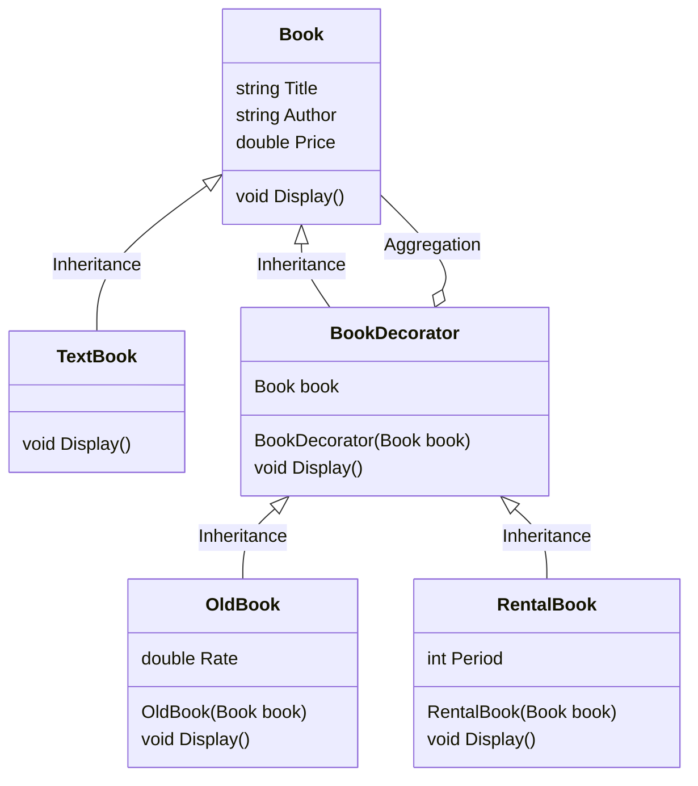

# 用途、ユースケースを自分の言葉で説明 (約1分)
Decorator は基本機能に後付で機能を追加するときなどに便利な設計だと思います。
状態によって持たせたい情報や機能が変わる モノ を表現するときに有効だと思います。
サンプルでは 本屋のレジで確認する 商品の状態 をイメージしています。

# サンプルの概要説明 (約1分)
本屋のレジで本の情報を表示しているイメージです。
商品として３種類の本をおいています。
通常の本
中古本
レンタル本

客が持ってきたときにどのように処理するのかデータを表示するイメージです。

base が 通常の本となり
デコレーターで 中古とレンタルに表示内容を追加します。

# クラス図の説明 (約1分)
    classA --|> classB : Inheritance(継承)
    classM ..|> classN : Realization(実装)
    classC --*  classD : Composition(構成)
    classE --o  classF : Aggregation(集計)
    classG -->  classH : Association(関連)
    classI --   classJ : Link(Solid)(リンク)
    classO ..   classP : Link(Dashed)(リンク)
    classK ..>  classL : Dependency(依存関係)
    + Public
    - Private
    # Protected
    * Abstract e.g.: someAbstractMethod()*
    $ Static e.g.: someStaticMethod()$

# ソースコードの説明 (約1分)
ソースコードは見てもらったほうがイメージがつくと思います。
ポイントに感じているところは委譲している点
- BookDecoratorがBookに委譲させること。
- 呼び出し側では Displayを呼ぶだけで良いこと。
- 基本情報はBookに追加するルールにすること
- 機能追加はDecoratorを継承したClassを追加するルールにすること。

# メリットを、サンプルコードを用いて自分の言葉で説明 (約1分)
- メリットに感じた点は ベースとなっている実態のTextBookの状態遷移を表現できる点だと思う。
このパターンでない場合は呼び出し側で処理が必要になるが、同一視しているためDisplayを呼ぶだけで成立している。

- 委譲を使っているからソースコードを書きかえずに Class を追加するのみで機能追加ができる点が醍醐味だと思った。

- コードの記述量が多くなるのと、Decoratorですよ！と明示しておかないと他のプログラマに関数を追加されたりするのでその点は注意。
