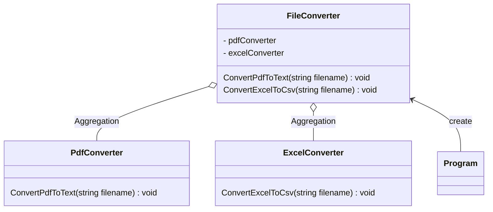

# 用途、ユースケースを自分の言葉で説明 (約1分)
Facadeパターンは複雑なシステム構成を隠してかんたんに使用できるためのラッパーを用意したもの。

ユースケース
- 外部API提供：内部を隠蔽できるのでこういうシーンで使いやすい？
- 機能拡張： ラッパーを用意するので何重にも被せれば拡張しやすくなる?
- 複数のサブシステムの簡素化： 呼び出す順番などを定めておき、引数を絞るなどで簡易的に使えるようになる。

# サンプルの概要説明 (約1分)
サンプルは ファイルコンバーターシステムです。
PDFを渡せば文字列に
Excelを渡せばcsvに変わるといったシステムのイメージです。

# クラス図の説明 (約1分)
    classA --|> classB : Inheritance(継承)
    classM ..|> classN : Realization(実装)
    classC --*  classD : Composition(構成)
    classE --o  classF : Aggregation(集計)
    classG -->  classH : Association(関連)
    classI --   classJ : Link(Solid)(リンク)
    classO ..   classP : Link(Dashed)(リンク)
    classK ..>  classL : Dependency(依存関係)
    + Public
    - Private
    # Protected
    * Abstract e.g.: someAbstractMethod()*
    $ Static e.g.: someStaticMethod()$

# ソースコードの説明 (約1分)
- Facade -> FileConverter
- Client -> Program
- SubSystem -> PdfConverter, ExcelConverter
 
PDFとExcelを文字列やcsvに変換するシステムがあるのみとなっています。
ポイントは2つで
- ProgramはFileConverterしか知らないが、PdfConverterとExcelConverterの関数を使えている点
- FileConverterはサブシステムに委譲することでProgramからの要求に答えること。

# メリットを、サンプルコードを用いて自分の言葉で説明 (約1分)
- interface 簡素化する。
サブシステムの複雑さを隠蔽することができる。 これにより、Program側のコードが簡素にできる。

- サブシステムの切り替え
- 保守性の向上
サブシステムを簡単に切り替えることができます。
例えば、ConvertPdfToTextからConvertPdfToText2に変更する必要がある場合、
Facadeクラスの呼び出しのみ変更で済む。

- 拡張性
新しいサブシステムを追加する場合、Facadeクラスに新しいメソッドを追加するだけで済む。

memo
- API が少なくなっていないとFacadeっぽくならない？
- PdfConverterの内部処理のほうがFacadeぽい？
 
宿題
- PdfConverterの中身が複雑になっている。という点を表現数
- PdfReader class が画像を返す。 string と byte をかえす。
- stringをあつめてかえす。
