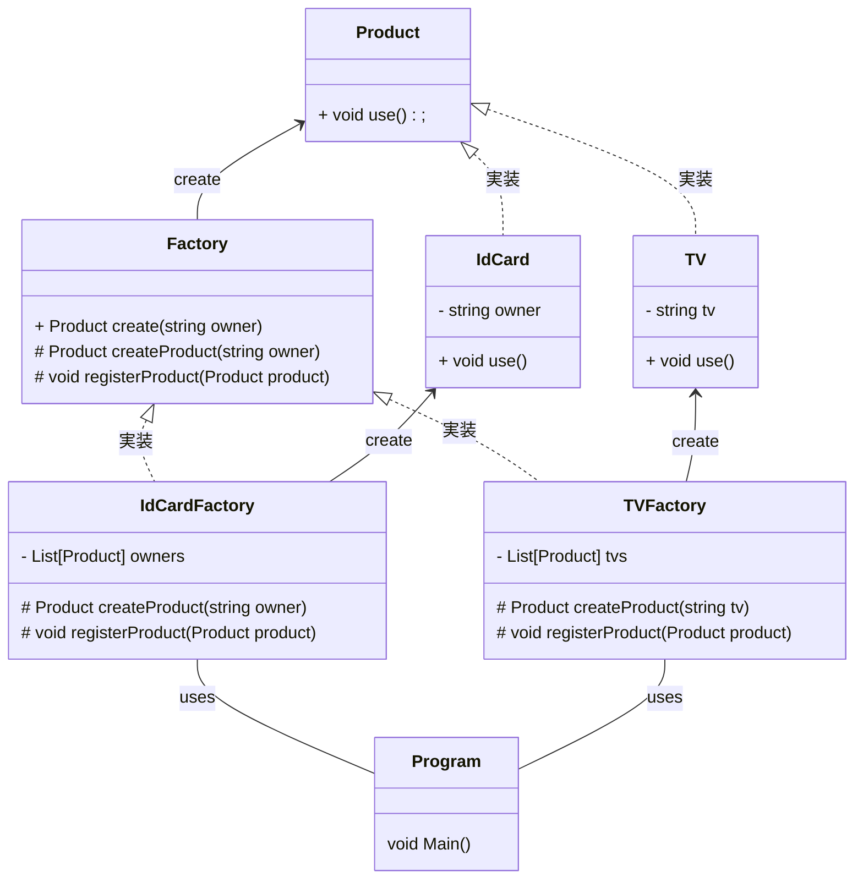

    classA --|> classB : Inheritance(継承)
    classM ..|> classN : Realization(実装)
    classC --*  classD : Composition(構成)
    classE --o  classF : Aggregation(集計)
    classG -->  classH : Association(関連)
    classI --   classJ : Link(Solid)(リンク)
    classO ..   classP : Link(Dashed)(リンク)
    classK ..>  classL : Dependency(依存関係)
    + Public
    - Private
    # Protected
    * Abstract e.g.: someAbstractMethod()*
    $ Static e.g.: someStaticMethod()$

# FactoryMethod Pattern
FactoryMethodPatter はTemplateMethodPatterを応用したパターンとなっている。
FactoryとProductというフレームワークを作ることで製品を作り出す工程を切り出すことができる。
このフレームワークはカードを作り出す場合でもその他の製品例えばテレビを作る場合でも応用できる。
フレームワークを修正せずに多くの製品に対応可能となる。

(previm は対応していないのでNotionで確認。mermaind 9.3.0 以上)

