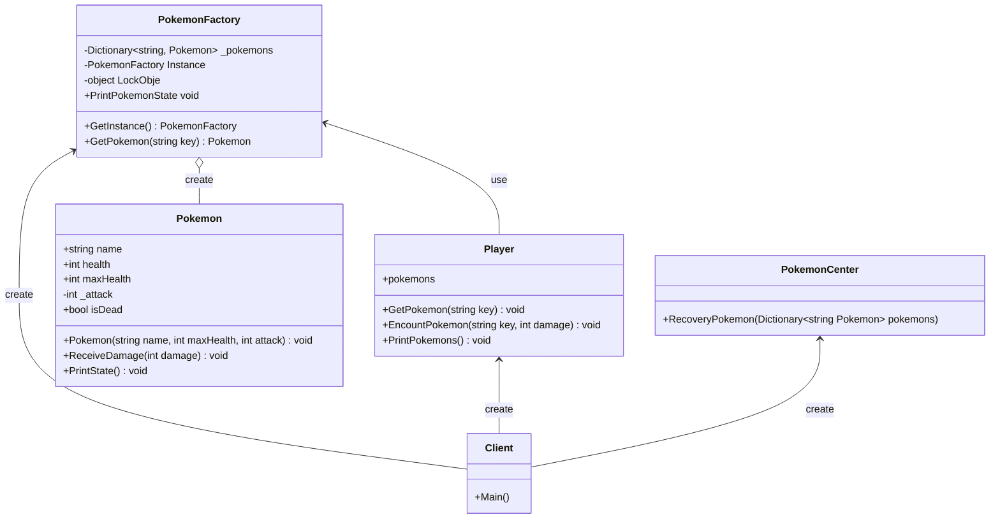

# 用途、ユースケースを自分の言葉で説明 (約1分)
Flyweightは一度生成したインスタンスを保持しておくことで生成コストを下げることを目的としたデザインパターンとなっている。
ユースケースはこんなかんじ

- テキストエディタの文字のトークン化(同じ文字が何度も出てくるため共有したい)
- オンラインゲームのオブジェクト(複数のユーザーが同じものを見るため共有したい)

# サンプルの概要説明 (約1分)
名前： ポケモンの状態管理システム
主人公が持ち歩いているポケモンをObjectとして管理している。
戦闘するときなどは同じインスタンスを見ることでダメージの確認などを行う。

# クラス図の説明 (約1分)
    classA --|> classB : Inheritance
    classC --* classD : Composition
    classE --o classF : Aggregation
    classG --> classH : Association
    classI -- classJ : Link(Solid)
    classK ..> classL : Dependency
    classM ..|> classN : Realization
    classO .. classP : Link(Dashed)

# ソースコードの説明 (約1分)
PokemonFactory -> FlyweightFactory
Pokemon        -> Flyweight
Client         -> Client
PokemonCenter  -> 該当なし

今回の実装でポイントになっている箇所は
- PokemonFactoryがPokemonのHashmapをもっていること。
- PokemonCenterからPokemonFactoryを参照するためSingletonにしたこと。

PokemonCenterにはFactoryを引数で渡したほうが依存度が下がるので
interfaceを作って複数のClientに対応させたほうが良かったかも。
その場合PokemonFactoryはSingletonではだめ。

使わなかった場合はPokemonの状態をなにかしらで保持しておかないと行けないため
スナップショットを取るとか、fieldを増やしてフィールドの管理などをする必要が出てくる。

# メリットを、サンプルコードを用いて自分の言葉で説明 (約1分)
- 嬉しいところは一度作ったPokemonのインスタンスを使い回せること。
Pokemonを生成する時間を省略できる。
しかし、メモリは開放されないので枯渇しないかどうかは気にしなければならない？
戦闘が始まるたびにインスタンスを作る。というようなことはしない。

- バケツリレーのようにPokemonインスタンスを渡さなくてもPokemonFactoryに問い合わせればいいので
引数をたどってソースを読む。みたいなことが発生しなくて嬉しそう。
フロント実装のReactのpropsのバケツリレーを想像して書いています。

# 疑問
- パフォーマンス向上のためにflyweightを採用するなら使わなかった場合のロスの計測方法が知りたいが、よくわからなかった。 
- Pokemonに実装したい機能を増やす場合はどうすればいいんだろう。

# 宿題
synchronizedしないと起きる問題について説明する。

マルチスレッドで動作する場面だと、1つしか存在しないはずのインスタンスが複数作られてしまう可能性がある。
同じインスタンスを見てプログラムを書いているつもりが別のものだったという事になり、バグとなる。

そのため排他制御の構文がC#には用意されており、それを使うことで対策が可能。
Singletonの勉強のときは [MethodImpl(MethodImplOptions.Synchronized)] という
アノテーションを使用したが、`lock{}` を使うだけで実現できるみたい。

[参考](https://ufcpp.net/study/csharp/sp_thread.html#threading)

# 変更点
PokemonFactory#GetInstance に排他制御を追加した。
Playerを作ってリュックサックをDictionaryで表現した。
PokemonCenterで回復するときはPlayerのリュックをわたすように修正した。
Pokemonの初期値は妥協して体力と攻撃力はマジックナンバー。

