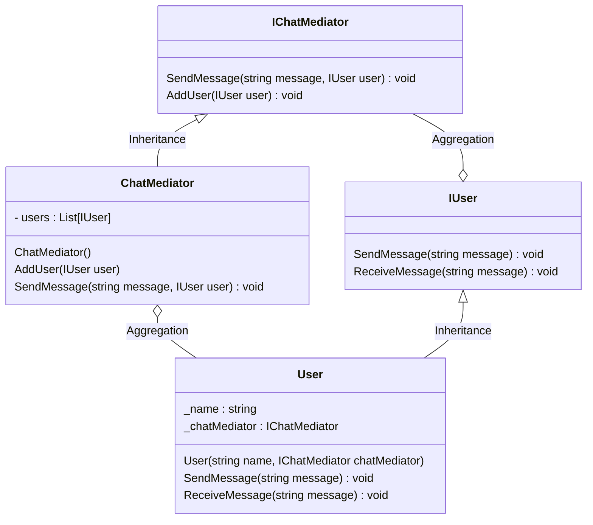

# 用途、ユースケースを自分の言葉で説明 (約1分)
Mediatorパターンは 管理者を一人置くことでオブジェクトの動作を決める情報を１箇所にまとめるような設計なる。
これがあることで、オブジェクトの動作を決める情報が複数あったとしも管理者に聞くだけで済む。その点が嬉しい。

ユースケース
ECなどのお買い物かご機能
旅行サイトの予約可否の確認機能
など

# サンプルの概要説明 (約1分)
サンプルは チャットの一斉送信機能です。
ConcreteMediator をチャットルームと見立てて、送信先の管理をしています。

    Mediator         -> IChatMediator
    ConcreteMediator -> ChatMediator
    Colleague        -> IUser
    ConcreteMediator -> User

# クラス図の説明 (約1分)
    classA --|> classB : Inheritance(継承)
    classM ..|> classN : Realization(実装)
    classC --*  classD : Composition(構成)
    classE --o  classF : Aggregation(集計)
    classG -->  classH : Association(関連)
    classI --   classJ : Link(Solid)(リンク)
    classO ..   classP : Link(Dashed)(リンク)
    classK ..>  classL : Dependency(依存関係)
    + Public
    - Private
    # Protected
    * Abstract e.g.: someAbstractMethod()*
    $ Static e.g.: someStaticMethod()$

# ソースコードの説明 (約1分)
Mediatorの役割はChatMediatorで行っているのでポイントはここだけで良いと思います。
ProgramでUserを作り、ChatMediatorに登録していきます。
所属しているUserがChatMediatorに向けてメッセージを送信するとusersに所属しているUserにメッセージが送信される機能を作っています。

# メリットを、サンプルコードを用いて自分の言葉で説明 (約1分)
- Userから見るとChatMediatorへメッセージを送信するだけでその時点での設定にあわせて送信先を決めてくれるため、自分で管理することが減るのが嬉しい。
- つまり User と User の結合がなくなっている。
- UserもMediatorを持っているので setMediator など新しい関数を追加すればチャットルームを切り替えたりもできそう。
- User役をどんどんと追加する場合は再利用して作成できるのでそこは追加しやすそうだが、ChatMediatorは機能追加するとどんどんややこしくなりそうなので使い所が難しいという感想。Mediatorを持っているので setMediator など新しい関数を追加すればチャットルームを切り替えたりもできそう。-

Facadeも似たような感じだったので整理が難しい。
委譲している関連があるかどうかが見極めポイントだと思う。

# デザパタ宿題
Userにミュート機能をつけてみる。