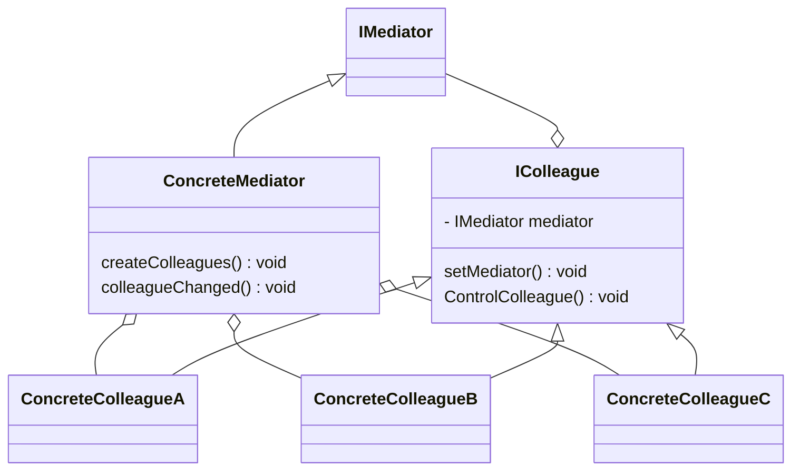

# 用途、ユースケースを自分の言葉で説明 (約1分)

# サンプルの概要説明 (約1分)
名前：自動車組立工場 在庫管理システム

# クラス図の説明 (約1分)

```mermaid
classDiagram
    class IMediator
    class IColleague {
        - IMediator mediator
        setMediator() void
        ControlColleague() void
    }
    class ConcreteMediator {
        createColleagues() void
        colleagueChanged() void
    }
    class ConcreteColleagueA
    class ConcreteColleagueB
    class ConcreteColleagueC

    IMediator <|-- ConcreteMediator
    IMediator --o IColleague
    ConcreteMediator o-- ConcreteColleagueA
    ConcreteMediator o-- ConcreteColleagueB
    ConcreteMediator o-- ConcreteColleagueC
    IColleague <|-- ConcreteColleagueA
    IColleague <|-- ConcreteColleagueB
    IColleague <|-- ConcreteColleagueC

```

# ソースコードの説明 (約1分)

# メリットを、サンプルコードを用いて自分の言葉で説明 (約1分)

