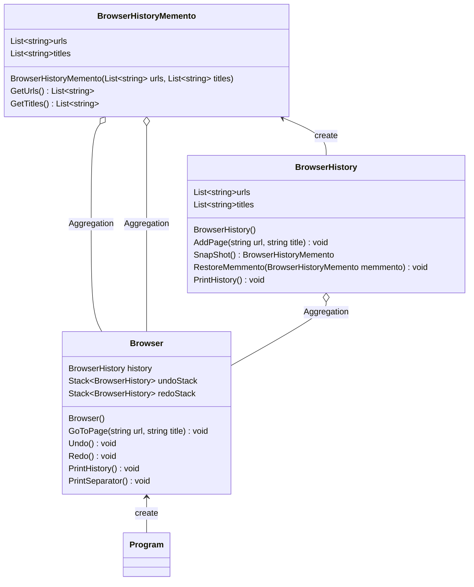

# 用途、ユースケースを自分の言葉で説明 (約1分)
MementoパターンはObjectの状態を保持するMemento役を管理して特定のバージョンを復元を可能にするデザインパターン

## 用途
- ブラウザの履歴機能
- text editor の undo redo
- gameの「続きから始める」機能
- スマホの戻るボタン

スタック構造でやっていると思われる機能はだいたいこれか？

# サンプルの概要説明 (約1分)
名前： ブラウザヒストリー

# クラス図の説明 (約1分)
    classA --|> classB : Inheritance
    classC --* classD : Composition
    classE --o classF : Aggregation
    classG --> classH : Association
    classI -- classJ : Link(Solid)
    classK ..> classL : Dependency
    classM ..|> classN : Realization
    classO .. classP : Link(Dashed)

# ソースコードの説明 (約1分)
BrowserがCareTaker役となっており、Programはそこに対して処理を書いています。
UndoやRedoメソッドを呼ぶと先にスクリーンショットを撮ってStackに保存します。
BrowserHistoryはOriginator役となっており、UndoRedoで渡されたMementoの状態に復元する役割を担っています。

# メリットを、サンプルコードを用いて自分の言葉で説明 (約1分)
- BrowserHistoryとBrowserで役割が別れていることで
誰が履歴を管理しているのか？(BrowserHistory)
誰が操作を行うのか？(Browser)を分けて書くことができるところが良い。

- BrowserHistoryMemento役を追加すればurlsだけ差し替える。などもできる。
titleしか保持しない。urlしか保持しない。があまり変更箇所多くなく実装できそう。

- BrowserHisotoryMemmentoがあることでUndoRedoが実現できており、やり直し機能が実現できるのが嬉しい。
ユーザがやっぱやめた。というときに自分で戻すことができる。

