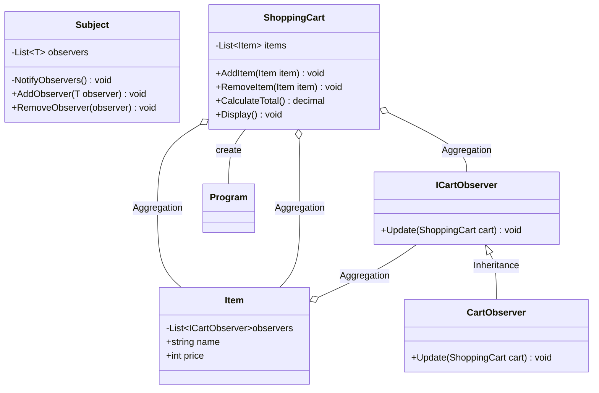

# 用途、ユースケースを自分の言葉で説明 (約1分)
Observerパターンは オブジェクトの変更をトリガーに関連するオブジェクトに通知を行うようなパターンです。

# サンプルの概要説明 (約1分)
名前： ECサイトの買い物かごシステム
コンビニとかで仕入れた商品を登録するような機能になってしまいました。

# クラス図の説明 (約1分)
    classA --|> classB : Inheritance
    classC --* classD : Composition
    classE --o classF : Aggregation
    classG --> classH : Association
    classI -- classJ : Link(Solid)
    classK ..> classL : Dependency
    classM ..|> classN : Realization
    classO .. classP : Link(Dashed)

# ソースコードの説明 (約1分)
**役割**
Subject          -> ShoppingCart
ConcreteSubject  -> Item
Observer         -> ICartObserver
ConcreteObserver -> CartObserver

ShoppingCartにItemを追加して、カートの中身を確認し合計を計算する機能を実装しています。
ShoppingCartにあるAddItemもしくはRemoveItemを呼ぶことたびにNotifyObserversで通知するようにしています。

通知しないと カートの中身が更新されない。のような状況を作って比較してみたかったのですが、やりかたが思いつかずそこまでできていません。

# メリットを、サンプルコードを用いて自分の言葉で説明 (約1分)
- 確認できてないので言えないかもですが、 ShoppingCartのなんかにある items をいつ参照しても同じ状態になっている。のように一貫性を保つことができる。
- ConcreteObserverを追加しておくことで新しい機能を追加しやすくなる。 Item が追加されたときをトリガーにいろんな事ができる。

つまり Observerの追加がしやすい。機能追加がしやすい。ということだと思う。

# 宿題
Subject役を切り出して ShoppingCart を分離してみる。
