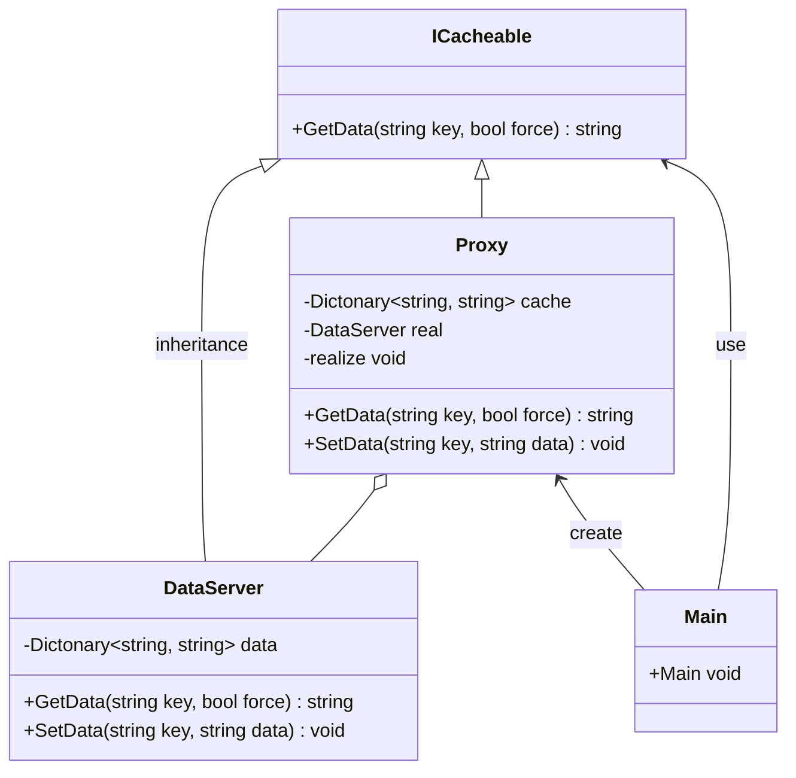

# 用途、ユースケースを自分の言葉で説明 (約1分)
ProxyパターンはSubjet役を生成するタイミングを調整し、処理を挟んだり、起動速度を早くするための設計パターン
よってユースケースはこんな感じ。

1. 認証機能 Proxyを通すことでUserの認証を行う。
2. ブラウザのキャッシュ機能 ネットワーク外側へのアクセスのうち静的なものをキャッシュする。
3. ロギング Proxyを経由することでログの生成を挟むことができる。

# サンプルの概要説明 (約1分)
名前： データサーバーへのアクセスシステム

# クラス図の説明 (約1分)
本に書かれているクラスがどれに該当するか説明する。
 | 本| sample|
 | ---|---|
 | Subject     | ICacheable |
 | Proxy       | Proxy|
 | RealSubject | DataServer|
 | Client      | Main|

# ソースコードの説明 (約1分)
- Mainを見せてから流れと役割を説明する。
MainではProxyのみ生成し、ICacheAbleに対してリクエストを投げるだけでDataServerへ適宜アクセスしてくれることを確認している。
GetData()へforce optionを渡せばDataServerへ必ず問い合わせる機能にした。
ただ、Testのやり方に困ったのでProxyへ直接リクエストする形になっている。

# メリットを、サンプルコードを用いて自分の言葉で説明 (約1分)
- 採用したときのメリット、デメリット
Proxyを挟むことで機能追加するときに変更点が少なくて済むことがメリット
ProxyがなければDataServerの中を触ることになる。

デメリットとしてはProxyを経由することで管理するClassが増えることくらいしか思いつかない。
DataServerを生成するタイミングをずれるので逆にコントロールが必要になるとか。

いずれにしてもメリットのほうが大きそう。
途中から入れるコスト（コード量）は大きい。

- 採用しないと起こるであろう問題
ProxyがなければDataServerの中を触ることになる。と書いたところが問題。
DataServerのポジションは複数のクラスから参照される。
影響範囲が大きくなるので保守がしにくいと言えると思う。

アクセス過多になってパフォーマンスが悪くなるとか。

