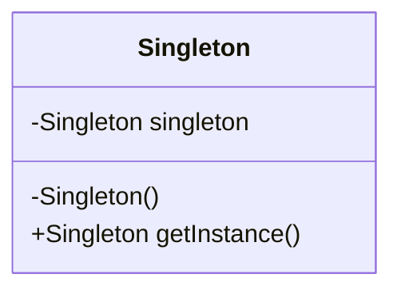

    classA --|> classB : Inheritance(継承)
    classM ..|> classN : Realization(実装)
    classC --*  classD : Composition(構成)
    classE --o  classF : Aggregation(集計)
    classG -->  classH : Association(関連)
    classI --   classJ : Link(Solid)(リンク)
    classO ..   classP : Link(Dashed)(リンク)
    classK ..>  classL : Dependency(依存関係)
    + Public
    - Private
    # Protected
    * Abstract e.g.: someAbstractMethod()*
    $ Static e.g.: someStaticMethod()$

# Singleton Pattern
このパターンはプログラム上に必ずインスタンスが１つしか作られない用にする設計パターンです。
どこから呼び出しても同じインスタンスを参照してほしい場合に使えます。

## なぜ制限を設ける必要があるのか？
「インスタンスが必ず１つのみである」という前提条件を課すことで複数あることを意識せず開発することができるメリットがある。

## インスタンスが生成されるタイミング
生成されるタイミングは 「最初にgetInstanceを呼び出したとき。」となる。
１回目のときはインスタンスの初期化が実行される。
２回目のときは初期化したインスタンスを参照する事となる。

