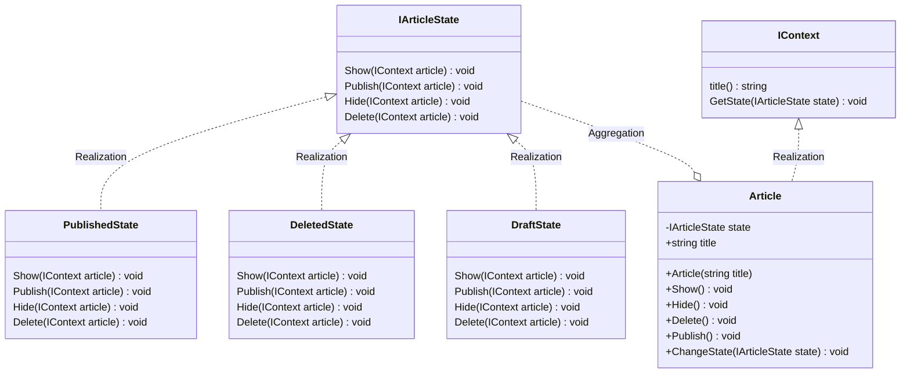

# 用途、ユースケースを自分の言葉で説明 (約1分)
Stateをクラスで表現し、それを切り替えることでContextの振る舞いを変更するような設計パターンのこと。
Context役はChangeStateのようなメソッドの実装が必要となる。

1.ECの注文状態管理
    - 注文状態によって表示内容が変わったり、できる操作が変わる。
2.在庫状態管理
    - 在庫の状態によって選択できる操作が変わる。
3.予約システムの予約状態管理
    - 予約状況によってメッセージやメール通知が変わる。
4.ゲームのキャラクターの状態管理(毒、麻痺、死亡、瀕死)
    - キャラクターの状態によって表示内容や行動制限をかける。

# サンプルの概要説明 (約1分)
名前： ブログ記事の状態管理システム

# クラス図の説明 (約1分)
    classA --|> classB : Inheritance
    classC --* classD : Composition
    classE --o classF : Aggregation
    classG --> classH : Association
    classI -- classJ : Link(Solid)
    classK ..> classL : Dependency
    classM ..|> classN : Realization
    classO .. classP : Link(Dashed)

# ソースコードの説明 (約1分)
役割
Article        -> Context
DraftState     -> ConcreteState
PublishedState -> ConcreteState
DeletedState   -> ConcreteState

ProgramがArticleをnewしたときは下書き状態がデフォルトのため、コンストラクターでDraftStateをsetしています。
その後はArticle.PublishなどするとDraftStateのPublish側でArticle.ChangeState()が呼ばれ状態遷移が表現されています。

実線は書いていませんが、ContextState同士は名前を直接使っているので密結合になっています。

# メリットを、サンプルコードを用いて自分の言葉で説明 (約1分)

Stateパターンのメリット：
- IArticleStateを実装していればChangeStateに対応できるので呼び出し側の修正が不要にできている。
- ConcreteStateごとに特別対応が必要な機能があればそのクラスにのみ実装すれば良いのでコードの重複が避けれそう。
たとえ話が思い浮かばなかった・・・
- Articleの中の条件分岐はなくす事ができる。 Stateパターンじゃない場合に、削除のときは〜非公開のときは〜のようなif~elseが大量に必要になる。

- 状態が増えたときにClassを追加すれば良いため修正箇所がわかりやすい。 と思ったが、ConcreateState同士にも修正が必要なので今の設計だとどうなのか？と思う。
例えばForceDeleteStateのようなStateを追加したい場合、IArticleにもForceDeleteを追加してArticleにもそれ用の呼び出しが必要になる。
