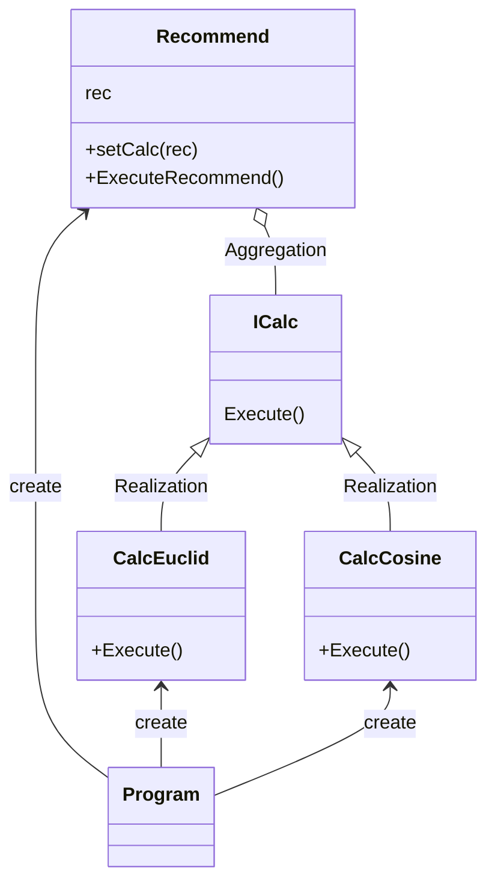

# 用途、ユースケースを自分の言葉で説明 (約1分)
Strategyパターンは、アルゴリズムを付け替えを容易にするための設計と言えます。
ポイントは委譲関係を使い、Interfaceに向けてプログラムを書くことでアルゴリズムが実装された
クラスの付替えを実現しているところです。

# サンプルの概要説明 (約1分)
Cosine類似度 と Euclid距離を切り替えて計算する場面を想定して書きました。

# クラス図の説明 (約1分)
    classA --|> classB : Inheritance(継承)
    classM ..|> classN : Realization(実装)
    classC --*  classD : Composition(構成)
    classE --o  classF : Aggregation(集計)
    classG -->  classH : Association(関連)
    classI --   classJ : Link(Solid)(リンク)
    classO ..   classP : Link(Dashed)(リンク)
    classK ..>  classL : Dependency(依存関係)
    + Public
    - Private
    # Protected
    * Abstract e.g.: someAbstractMethod()*
    $ Static e.g.: someStaticMethod()$

# ソースコードの説明 (約1分)
呼び出し元では `ExecuteRecommend()` を呼び出すだけで中がどちらのロジックになっているかはわからない構造になっています。
最初に CalcCosine などを設定しておけば変更しない限り計算ロジックは変わらないので
管理画面で切り替えるとかで使うロジックかな？

自分が書いたサンプルはProgramがnewしているのでそこはリファクタリングしたい。

# メリットを、サンプルコードを用いて自分の言葉で説明 (約1分)
- 委譲をつかってゆるい関係にすることでClassの付け替えが可能になっているため、この構造自体がメリット。
- あとから同じグループのClassが増えることが想定されるなら最初からこの構造にしておくと楽そう。基準は3個以上とか？
- 実行中にアルゴリズムの変更が可能のため、フロント側の課題解決として出てくる。

宿題は Neo富豪のソースコードにある。
ストラテジーパターンの使用例を探す。
