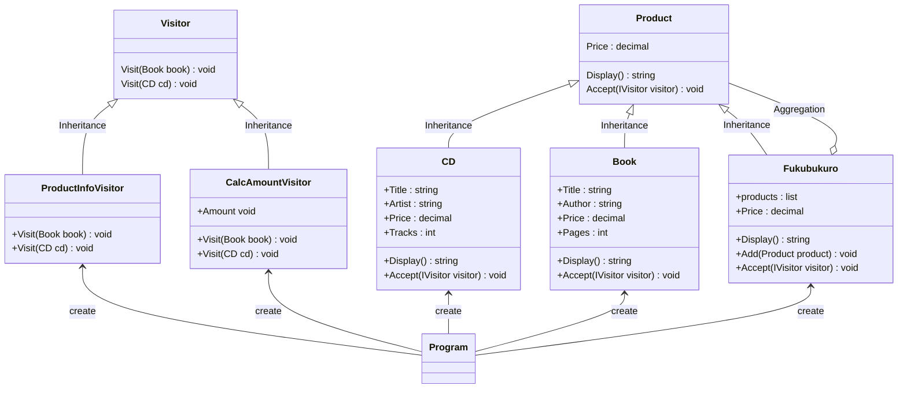

# 用途、ユースケースを自分の言葉で説明 (約1分)
Visitor パターンはデータに対して行う処理を外に抜き出して共通化するような設計パターンとなっている。
本の冒頭にも書かれていますが、「データ構造と処理を分離する」を実現する設計パターンです。
ユースケースとしては
- 従業員管理システムの役職ごとの給与計算で計算ロジックを分割する
- 商品管理システムでその商品を加工するロジックを分割する
とかかな？

# サンプルの概要説明 (約1分)
商品管理システムです。
商品登録の際の確認画面で情報を確認しているイメージで書いています。

# クラス図の説明 (約1分)
    classA --|> classB : Inheritance(継承)
    classM ..|> classN : Realization(実装)
    classC --*  classD : Composition(構成)
    classE --o  classF : Aggregation(集計)
    classG -->  classH : Association(関連)
    classI --   classJ : Link(Solid)(リンク)
    classO ..   classP : Link(Dashed)(リンク)
    classK ..>  classL : Dependency(依存関係)
    + Public
    - Private
    # Protected
    * Abstract e.g.: someAbstractMethod()*
    $ Static e.g.: someStaticMethod()$

# ソースコードの説明 (約1分)
ProductInfoVisitor が 訪問者として CDとBOOKの情報を閲覧する役割をしています。
訪問するためには受け入れ役が必要なのでその役割は Product が担っています。
Book と CD は Product を継承しているため ProductInfoVisitor が訪れた場合に情報の提供ができる仕組みとなっています。

# メリットを、サンプルコードを用いて自分の言葉で説明 (約1分)
- たとえば Book と CD に対して処理を追加したいとなった場合に
Visitor側に追加すればBookなどは触らなくてもすむため影響範囲を小さくできるのでは?

- Bookの中に処理がある場合にBookを新しくインスタン生成しなくてはならなくなったりするが、
Visitor約をつくっておけばBookのインスタンスはそのまま使えるはず？

これまでだと Product 側に共通メソッドを追いて対応してきたが
Visitorができることで全く別のClassに処理を任せているため依存度が下がったと言える？

