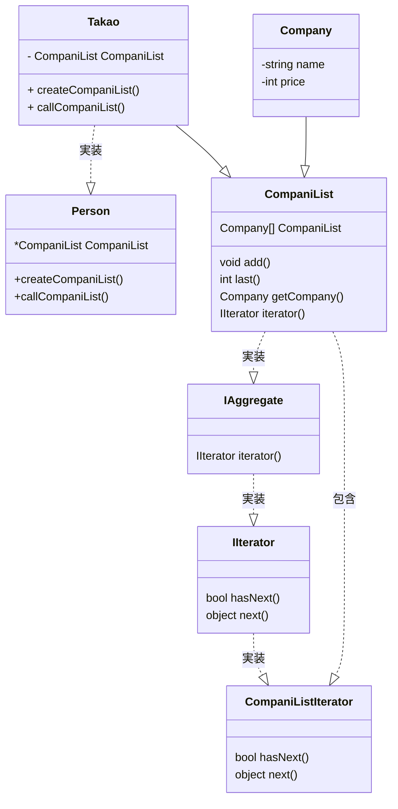

```mermaid
classDiagram
    IAggregate  ..|> IIterator           : 実装
    IIterator   ..|> CompaniListIterator : 実装
    CompaniList ..|> IAggregate          : 実装
    CompaniList ..|> CompaniListIterator : 包含
    Takao       ..|> Person              : 実装
    Takao       --|> CompaniList
    Company     --|> CompaniList

    class IAggregate{
        IIterator iterator()
    }

    class IIterator{
        bool hasNext()
        object next()
    }

    class CompaniListIterator{
        bool hasNext()
        object next()
    }

    class CompaniList{
        Company[] CompaniList
        void add()
        int last()
        Company getCompany()
        IIterator iterator()
    }

    class Company{
        -string name
        -int price
    }

    class Person{
        *CompaniList CompaniList
        +createCompaniList()
        +callCompaniList()
    }

    class Takao{
        - CompaniList CompaniList
        + createCompaniList()
        + callCompaniList()
    }

```

