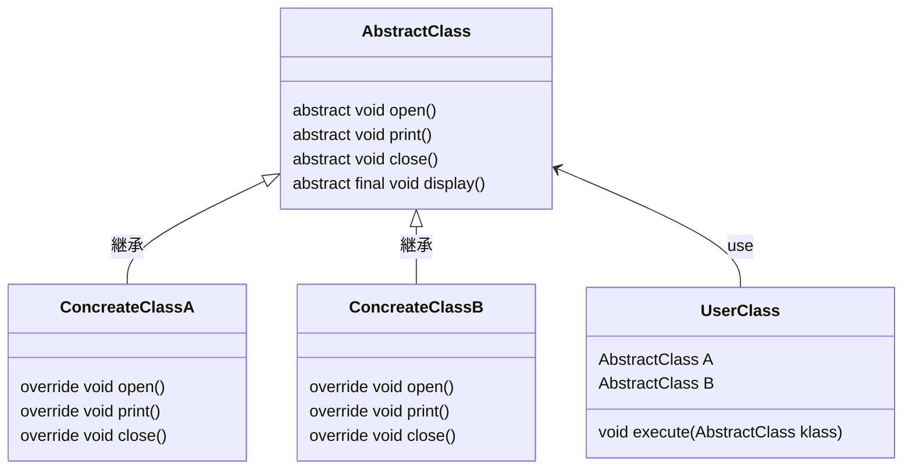

    classA --|> classB : Inheritance(継承)
    classM ..|> classN : Realization(実装)
    classC --*  classD : Composition(構成)
    classE --o  classF : Aggregation(集計)
    classG -->  classH : Association(関連)
    classI --   classJ : Link(Solid)(リンク)
    classO ..   classP : Link(Dashed)(リンク)
    classK ..>  classL : Dependency(依存関係)

# Template Method Pattern
抽象クラスに定義している `display` メソッドがテンプレートメソッドと呼ばれる。
可変するのは `Concreate~` クラスで dispalay の動作に合わせて実装する必要がある。
動きが保証されるのがメリットだが、抽象クラスの中を知っておかないとプログラミング出来ない不便さはある。

- UserClass が実行
- AbstractClass がテンプレートを定義されるている
- ConcreateClassA が`open` などを定義する(displayはoverride出来ない用にする)
- ConcreateClassB が`open` などを定義する(displayはoverride出来ない用にする)

