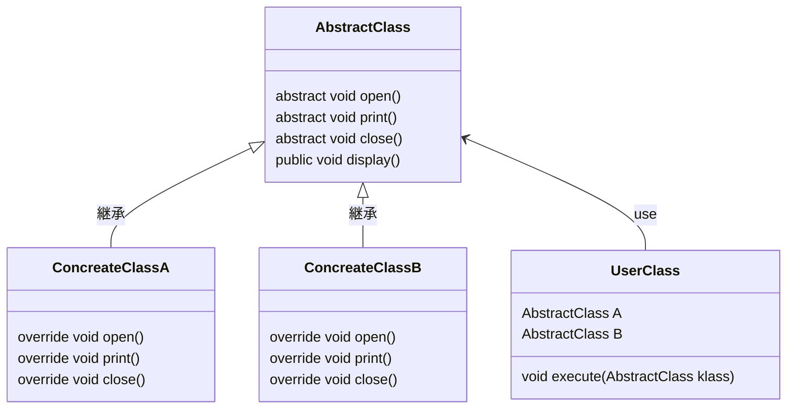

    classA --|> classB : Inheritance(継承)
    classM ..|> classN : Realization(実装)
    classC --*  classD : Composition(構成)
    classE --o  classF : Aggregation(集計)
    classG -->  classH : Association(関連)
    classI --   classJ : Link(Solid)(リンク)
    classO ..   classP : Link(Dashed)(リンク)
    classK ..>  classL : Dependency(依存関係)

# Template Method Pattern
抽象クラスに定義している `display` メソッドがテンプレートメソッド。
可変するのは `Concreate~` クラスで dispalay が動くように実装することが求められる。
共通化がメリットだが、抽象クラスの中をみないとプログラミング出来ない不便さがある。

- UserClass が実行
- AbstractClass がテンプレートを持つ。
- ConcreateClassA がメソッドを実装(displayはoverrideしない)
- ConcreateClassB がメソッドを実装(displayはoverrideしない)

